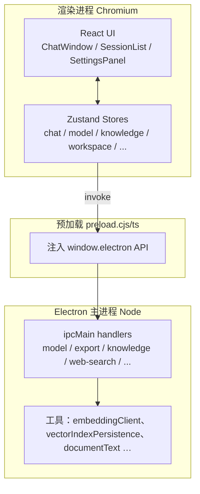
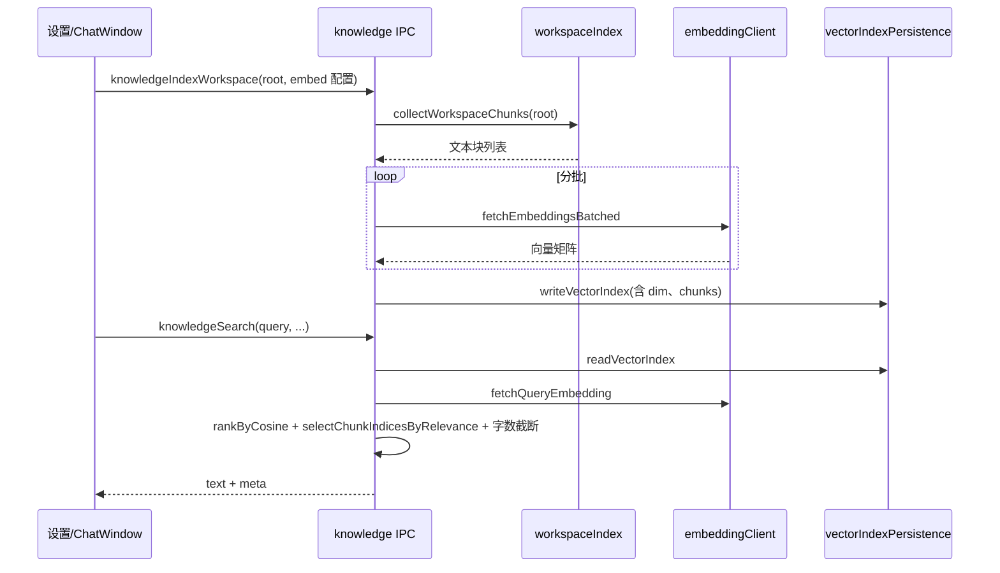

# MyAgent 架构设计说明

## 1. 设计目标与约束

- **本地优先**：对话与偏好默认驻留客户端；模型推理可发生在用户自管的云端 API 或本地 Ollama，由用户配置。
- **职责分离**：渲染进程负责交互与即时状态；主进程承载文件访问、HTTPS 出站、以及与操作系统相关能力（快捷键、托盘等，以实现对齐）。
- **可替换供应商**：文本模型、嵌入向量、网页搜索均采用可插拔的「提供商 + endpoint + model」模型。

## 2. 逻辑分层

### 2.1 展示层（`src/`）

- **组件**：会话列表 `SessionList`、对话主区 `ChatWindow`、气泡 `MessageItem`、Markdown 渲染 `MarkdownContent`、设置 `SettingsPanel`、引导 `OnboardingSteps`。
- **状态**：会话 `chatStore`、模型列表 `modelStore`、知识与嵌入 `knowledgeStore`、工作区 `workspaceStore`、联网 `webSearchStore`、全局设置 `settingStore`。
- **国际化**：文案聚合于 `src/i18n/ui.ts`，通过 `useI18n()` 取用。

### 2.2 预加载与会话边界

- `preload` 暴露白名单 API（`callModel`、`knowledgeSearch`、`persistGet`/`persistSet`、`readWorkspaceHint`、`webSearch` 等），避免渲染进程直接使用任意 Node/Electron 模块（具体以 `preload.cjs` 与类型定义为准）。

### 2.3 主进程（`electron/`）

| 模块 | 职责概要 |
|------|----------|
| `ipc/model`、`ipc/model-stream` | HTTP(S) 请求大模型，非流式与 SSE 流式；错误归一与用户可见提示 |
| `ipc/export`、`ipc/file`、`ipc/documents` | 工作区枚举、会话导出路径、结构化文档读取与辅助导出 |
| `ipc/web-search` | 封装各搜索后端 |
| `ipc/knowledge` + `utils/workspaceIndex`、`vectorIndexPersistence`、`embeddingClient` | 建索引时分块→嵌入批量请求→向量文件落盘；查询时单次查询嵌入→余弦相似度排序→相关度截断 |
| `utils/documentText` | Excel / Word / Markdown 转为模型可读正文 |
| `utils/markdownExport` | 从助手 Markdown 管道表生成 xlsx/docx |

## 3. 关键数据流

### 3.1 发送一条用户消息（简化）

1. 用户在 `ChatWindow` 编辑文本与可选附件；
2. 渲染进程通过 `enrichMessagesForModel` 拉取附件解析结果并入消息列表快照；
3. 若启用工作区：`readWorkspaceHint`、可选 `knowledgeSearch`（在主进程读取索引与嵌入）；
4. 若满足联网触发条件：`webSearch`；
5. 合并后的 messages 发往 `subscribeModelStream` 或等价非流接口；
6. 流式增量回写会话 store，收尾后持久化。

### 3.2 向量知识库流水线

## 4. 持久化与客户数据

- 会话与用户偏好：**Zustand + 自定义持久化**，并可通过 `persistSet`/`persistGet` 落在 `userData` 下的 JSON（与 Electron 策略一致）。
- 向量索引：独立 JSON 文件（参见 `vectorIndexFilePath()`），与用户聊天历史分离存放。

## 5. 安全与网络

- 联网与模型调用均在主进程或受控链路发起以便统一超时与密钥不落日志（实现上应避免将完整密钥打印到控制台）。
- `webPreferences`（见 `electron/main.ts`）为历史兼容可能存在放宽项；新版本评估时应逐项收紧与安全审计。

## 6. 构建与分发

- **Vite**：打包渲染层；
- **`vite-plugin-electron`**：联动主进程/预加载；
- **`electron-builder`**：按目标平台产出 DMG/Setup/AppImage；
- CI 可选用 `npm run build` + 各目标 `npm run package:*`。

---

*本文描述与仓库代码一致；迭代后请同步更新需求清单与设计文档章节。*
